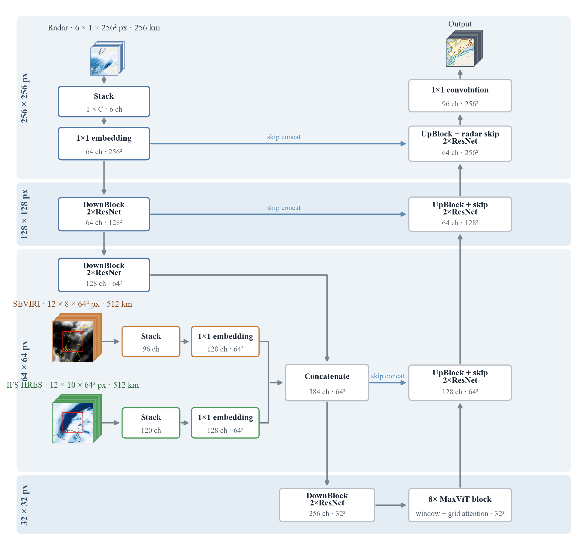

# Multi-source precipitation forecasting architecture

Neural-network architecture for probabilistic, multi-source hourly rainfall prediction up to 12 hours ahead over the Netherlands.

## Architecture



The architecture has three input branches:

| Source | Example input shape |
|---|---|
| Radar | `[B, 6, 1, 256, 256]` |
| SEVIRI | `[B, 12, 8, 64, 64]` |
| IFS HRES | `[B, 12, 10, 64, 64]` |

Inputs used for training:

- Radar: [KNMI gauge-corrected rainfall](https://dataplatform.knmi.nl/dataset/nl-rdr-data-rfcor-5m-1-0), hourly, 1 km, over a 256 x 256 km target domain (6 past-hour frames).
- SEVIRI: 8 channels from [EUMETSAT MSG](https://data.eumetsat.int/product/EO:EUM:DAT:MSG:HRSEVIRI), hourly, bilinearly interpolated to 8 km over a wider 512 x 512 km context (12 frames).
- IFS HRES: 10 surface variables from [ECMWF](https://www.ecmwf.int/en/forecasts/dataset/operational-archive), hourly forecast steps, bilinearly interpolated to 8 km over the 512 x 512 km context (12 lead times).

The model supports four source combinations through `aux_sources`:

```python
[]                         # radar only
["satellite"]              # radar + SEVIRI
["ifs"]                    # radar + IFS
["satellite", "ifs"]       # radar + SEVIRI + IFS
```

## Minimal example

Install PyTorch and run the included synthetic example:

```bash
python -m pip install -r requirements.txt
python example.py
python -m unittest discover -s tests
```

Basic use:

```python
import torch

from model import MultiSourcePrecipitationModel

model = MultiSourcePrecipitationModel(
    input_frames=6,
    aux_sources=["ifs"],
)

radar = torch.randn(1, 6, 1, 256, 256)
ifs = torch.randn(1, 12, 10, 64, 64)

with torch.no_grad():
    logits = model(radar, ifs=ifs)

print(logits.shape)  # torch.Size([1, 12, 8, 256, 256])
```

## Relationship to RainPro-8

This architecture adapts the encoder-MaxViT-decoder design of
[RainPro-8](https://arxiv.org/abs/2505.10271) ([code](https://github.com/rafapablos/RainPro)).
See [NOTICE.md](NOTICE.md).
